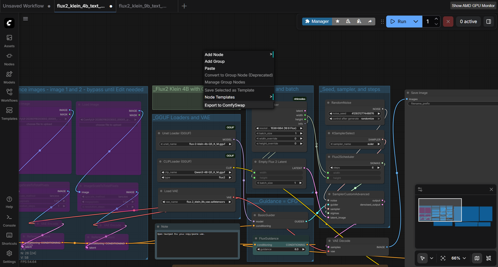
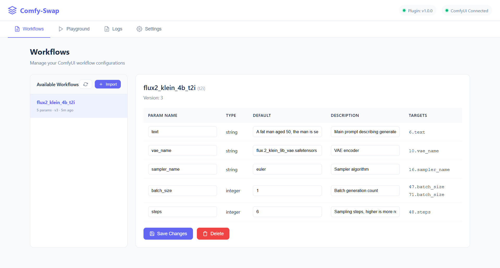
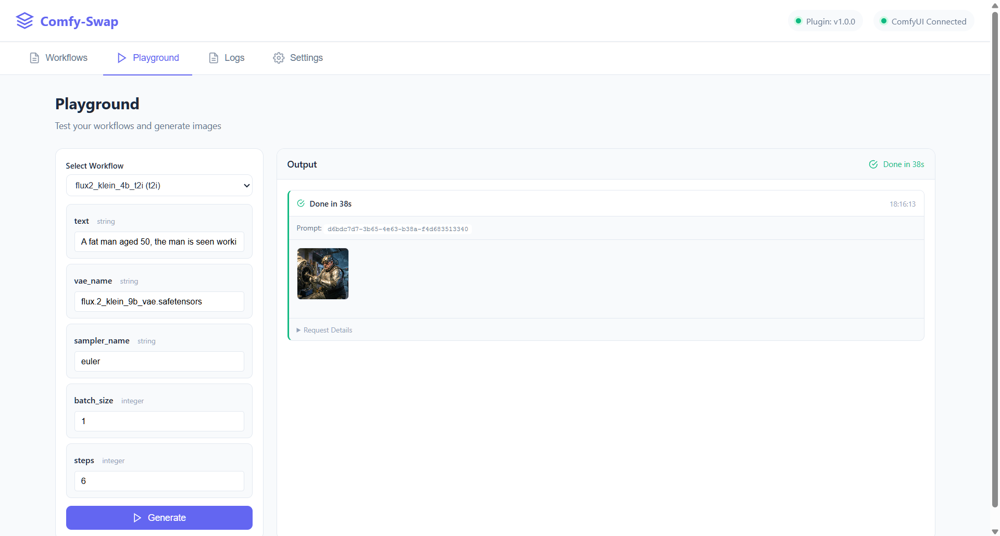
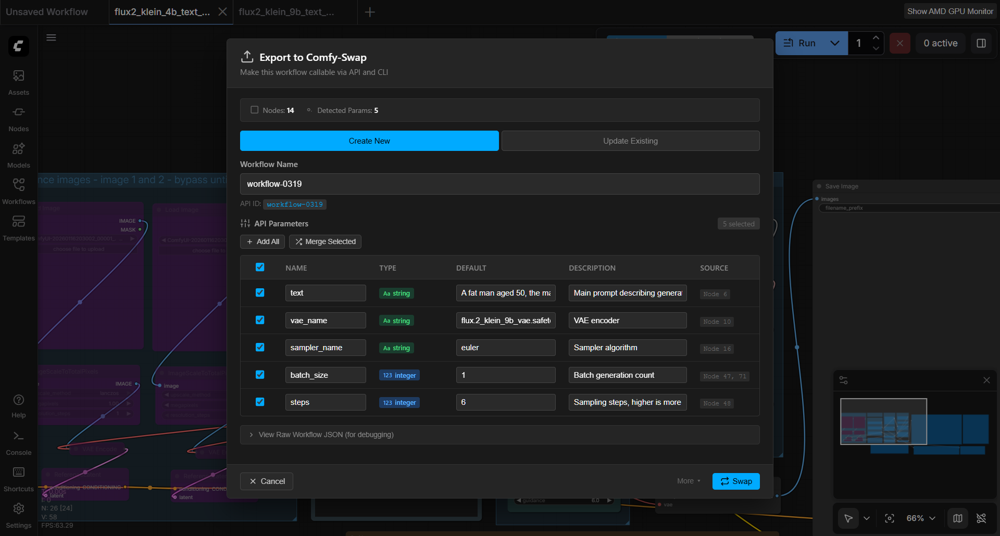
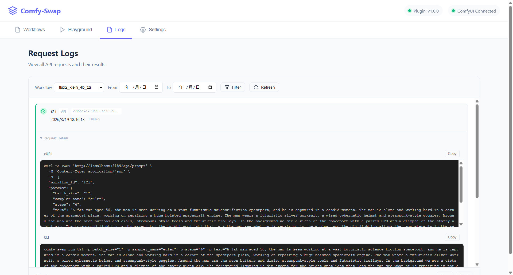

# Comfy-Swap

[English](README.md) | [中文](README_CN.md)

[](LICENSE)
[](https://github.com/kamjin3086/comfy-swap-skill)

**Comfy-Swap** exposes ComfyUI workflows as stable, production-ready APIs. It bridges the gap between ComfyUI's visual workflow design and real-world application integration.

---

## For AI Agents

> **AI agents** (Claude Code, Cursor, Codex, etc.) can install the comfy-swap skill to automate image generation workflows.

**Install skill (recommended methods, in order):**

```bash
# 1. Via skills.sh (universal, works with most agents)
npx skills add kamjin3086/comfy-swap-skill

# 2. Via openskills (Claude Code compatible)
npx openskills install kamjin3086/comfy-swap-skill

# 3. Manual clone (fallback)
git clone https://github.com/kamjin3086/comfy-swap-skill.git ~/.agents/skills/comfy-swap
```

After installation, agents can run `comfy-swap health` to verify setup, then use CLI commands to list workflows, run generations, and manage parameters.

**Skill repository:** [kamjin3086/comfy-swap-skill](https://github.com/kamjin3086/comfy-swap-skill)

---

## Screenshots

### ComfyUI Plugin - Export Dialog


### Comfy-Swap Web UI - Workflows & Playground




---

## What It Does

Comfy-Swap turns complex ComfyUI workflows into **simple, unified API endpoints** that are:

- **AI Agent Friendly** — Clean JSON interface, predictable parameters, easy for LLMs and automation tools to call
- **Developer Friendly** — Same workflow, same parameters, whether you use REST API or CLI
- **Production Ready** — Stable API contracts that don't break when you update your workflow internals

### REST API

```bash
curl -X POST 'http://localhost:8189/api/prompt' \
  -H 'Content-Type: application/json' \
  -d '{
    "workflow_id": "portrait-gen",
    "params": {
      "prompt": "professional headshot, studio lighting",
      "seed": 42
    }
  }'
```

### CLI

```bash
comfy-swap run portrait-gen prompt="professional headshot" seed=42 --wait --save ./output/
```

**Same workflow. Same parameters. Choose your interface.**

## Why Comfy-Swap?

| Problem | Solution |
|---------|----------|
| ComfyUI workflows are complex JSON with node IDs | Comfy-Swap provides named parameters like `prompt`, `seed`, `image` |
| Changing workflow internals breaks integrations | Parameter mapping keeps your API stable |
| Hard to call from scripts, agents, or automation | Simple REST/CLI with consistent interface |
| No unified way to track API usage | Built-in request logging with filtering |

## Key Features

- **Workflow → API**: Export any ComfyUI workflow as a callable API endpoint
- **Parameter Mapping**: Map friendly names to internal node fields (one param → multiple nodes)
- **Dual Interface**: REST API and CLI share identical parameters
- **Image I/O**: Upload images as inputs, download generated outputs
- **Request Logs**: Track all API calls with workflow filtering and time range
- **Web Playground**: Test workflows interactively before integration
- **Backup/Restore**: Export all configurations for migration

## What It Does NOT Do

Comfy-Swap focuses on **workflow exposure and API integration**. It intentionally does not:

- ❌ Manage ComfyUI installation or updates
- ❌ Install or manage custom nodes
- ❌ Provide workflow editing UI
- ❌ Replace ComfyUI's execution engine

These are handled by ComfyUI itself or [ComfyUI Manager](https://github.com/ltdrdata/ComfyUI-Manager).

---

## Quick Start

### 1. Download & Install

Download the latest release for your platform from [**Releases**](https://github.com/kamjin3086/comfy-swap/releases).

**Add to PATH for global access (recommended):**

<details>
<summary><b>Windows (PowerShell)</b></summary>

```powershell
# Copy to a PATH location (easiest)
Copy-Item comfy-swap.exe -Destination "$env:LOCALAPPDATA\Microsoft\WindowsApps\"

# Or add custom directory to PATH permanently
$binPath = "C:\path\to\comfy-swap"
[Environment]::SetEnvironmentVariable("Path", $env:Path + ";$binPath", "User")
```
</details>

<details>
<summary><b>macOS / Linux</b></summary>

```bash
# Move to a standard PATH location
sudo mv comfy-swap /usr/local/bin/

# Or add to PATH in shell profile
echo 'export PATH="$PATH:/path/to/comfy-swap-dir"' >> ~/.bashrc
source ~/.bashrc
```
</details>

Verify installation: `comfy-swap version`

### 2. Start the Server

```bash
comfy-swap serve
```

Open `http://localhost:8189` to complete setup.

> **Build from source:** `git clone` + `go build -o comfy-swap .` (requires Go 1.21+)

### 2. Install ComfyUI Plugin

**Option A: Git Clone (Recommended)**

```bash
cd /path/to/ComfyUI/custom_nodes
git clone https://github.com/kamjin3086/ComfyUI-ComfySwap.git
```

Restart ComfyUI after installation.

<details>
<summary><b>Option B: Download ZIP</b></summary>

1. Open Comfy-Swap web UI (`http://localhost:8189`)
2. Go to **Settings** → **Plugin Installation** → **Download**
3. Click **Download Plugin ZIP**
4. Extract to `ComfyUI/custom_nodes/ComfyUI-ComfySwap`
5. Restart ComfyUI

</details>

### 3. Export Your Workflow

In ComfyUI: Right-click canvas → **Export to ComfySwap** → Configure parameters → Swap



This makes your workflow available through Comfy-Swap's unified API and CLI interface.

### 4. Call Your API

```bash
# REST API
curl -X POST 'http://localhost:8189/api/prompt' \
  -H 'Content-Type: application/json' \
  -d '{"workflow_id": "my-workflow", "params": {"prompt": "a cat"}}'

# CLI
comfy-swap run my-workflow prompt="a cat" --wait
```

## CLI Commands

```bash
# Show all commands and options
comfy-swap --help
comfy-swap run --help
```

| Command | Description |
|---------|-------------|
| `serve` | Start HTTP server |
| `config get/set` | View or update configuration |
| `list` | List all workflows |
| `info <id>` | Show workflow details |
| `import` | Import workflow from JSON or sync pending |
| `workflow` | Manage workflow parameters (nodes, add-param, update-param, etc.) |
| `run <id> key=value` | Execute workflow |
| `status <prompt_id>` | Check execution status |
| `result <prompt_id>` | Get results (with `--save`) |
| `logs` | View request logs |
| `health` | Server health check |

**Global flags:** `-s, --server` (server URL), `-q, --quiet`, `--json`, `--pretty`

## API Endpoints

| Endpoint | Method | Description |
|----------|--------|-------------|
| `/api/prompt` | POST | Execute workflow |
| `/api/workflows` | GET | List workflows |
| `/api/workflows/{id}` | GET | Get workflow details |
| `/api/history/{prompt_id}` | GET | Execution history |
| `/api/logs` | GET | Request logs |
| `/api/upload` | POST | Upload image |
| `/api/view` | GET | Download output |

## Parameter Mapping

```json
{
  "name": "seed",
  "type": "integer",
  "default": -1,
  "description": "Random seed, -1 for random",
  "targets": [
    { "node_id": "3", "field": "seed" },
    { "node_id": "9", "field": "seed" }
  ]
}
```

One `seed` parameter automatically updates multiple nodes. Your API stays clean.

## More Screenshots

<details>
<summary><b>Request Logs</b></summary>



</details>

## License

[MIT](LICENSE)
